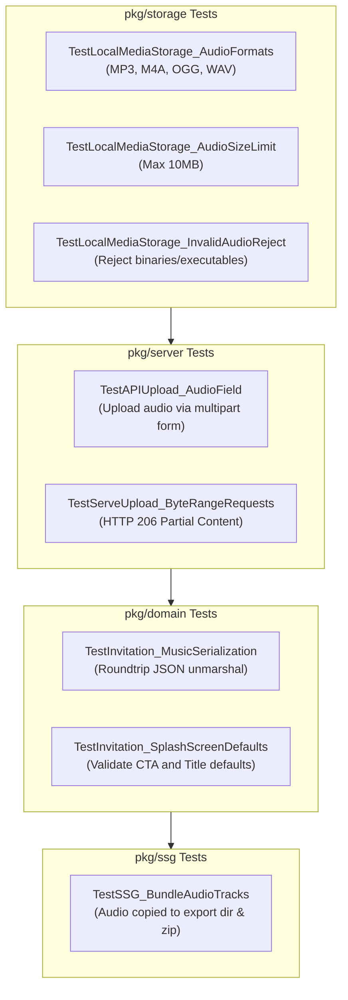

# Iteration 5: SSG Export, Automated Testing & Verification

## 1. Goal & Rationale
Ensure the entire end-to-end flow is robust, verified across all layers, and that static site exports (`pkg/ssg`) bundle audio files and splash screens without manual intervention.

---

## 2. Static Site Generator (SSG) Verification (`pkg/ssg/ssg.go`)

### 2.1 Asset Bundling Pipeline
Invito's SSG generator (`copyUploadsStatic` in [`pkg/ssg/ssg.go`](file:///home/nano/projects/invitation/pkg/ssg/ssg.go)) walks `uploadsDir` and copies all contents to `<OutputDir>/uploads/`:
* Uploaded audio files (`/uploads/*.mp3`, `*.m4a`) are automatically copied into the exported static directory and archived in the resulting `.zip`.
* Exported HTML pages will contain relative audio paths matching the static bundle directory structure.

### 2.2 CLI Export Test
Execute:
```bash
./bin/invito --export=_demo --zip --slug=wedding-celebration
```
Verify:
1. `_demo/uploads/` contains the audio track.
2. `_demo/i/wedding-celebration/index.html` contains `<audio id="inv-bg-audio">` and splash screen markup.
3. Serving `_demo/` via any static file server (`python3 -m http.server` or `npx serve`) allows the splash screen to open and audio to play smoothly.

---

## 3. Test Suite Matrix



### 3.1 Unit & Integration Test Specifications

1. **`pkg/storage/local_media_test.go`**:
   - `TestSniffMIMEType_Audio`: Validate MIME detection for MP3 (ID3v2 header and sync frame), M4A, OGG, and WAV.
   - `TestSave_AudioFileTooLarge`: Test that files exceeding 10MB are rejected with `ErrFileTooLarge`.
   - `TestSave_AudioSuccess`: Test atomic file persistence and URL generation (`/uploads/...`).

2. **`pkg/server/server_test.go`**:
   - `TestAPIUpload_Audio`: Test `POST /api/upload` with an audio file under field name `audio`, ensuring status `201 Created` and JSON response with `url`.
   - `TestServeUpload_RangeHeaders`: Send HTTP `GET /uploads/{audio-file}` with `Range: bytes=0-100` and assert status `206 Partial Content` with `Content-Range: bytes 0-100/...`.

3. **`pkg/domain/invitation_test.go`**:
   - `TestInvitation_MusicAndSplashJSON`: Verify serialization and deserialization of `MusicConfig` and `SplashScreenConfig`.
   - Test backward compatibility: Unmarshaling legacy invitations without `music` or `splash_screen` must not fail.

4. **`pkg/ssg/ssg_test.go`**:
   - `TestExport_WithAudioUpload`: Verify that an exported invitation includes the audio track in `outputDir/uploads/` and in the exported `.zip`.

---

## 4. Cross-Platform Manual Verification Checklist

| Scenario | Test Steps | Expected Result |
| :--- | :--- | :--- |
| **iOS Safari (Mobile)** | Open invitation with splash enabled. Tap "Open Invitation". | Splash dismisses smoothly; audio begins playing unmuted without prompt or error. |
| **Android Chrome (Mobile)** | Open invitation with splash enabled. Tap "Open Invitation". | Audio begins playing immediately with soft fade-in. |
| **Splash Disabled (Fallback)** | Open invitation where `splash_screen.enabled = false`. Tap or scroll anywhere. | First pointer gesture starts music playback automatically. |
| **Floating FAB Play/Pause** | Tap floating music button while playing. Tap again. | Audio pauses and vinyl stops; audio resumes and vinyl spins. |
| **Background / Lock Screen** | Switch to another browser tab or lock phone screen. | Audio pauses automatically (`visibilitychange`); resumes or stays paused per state. |
| **Admin Builder Studio** | Upload a 5MB MP3 file via Admin Studio. | Upload completes, preview audio element plays, and live preview iframe reflects change. |
