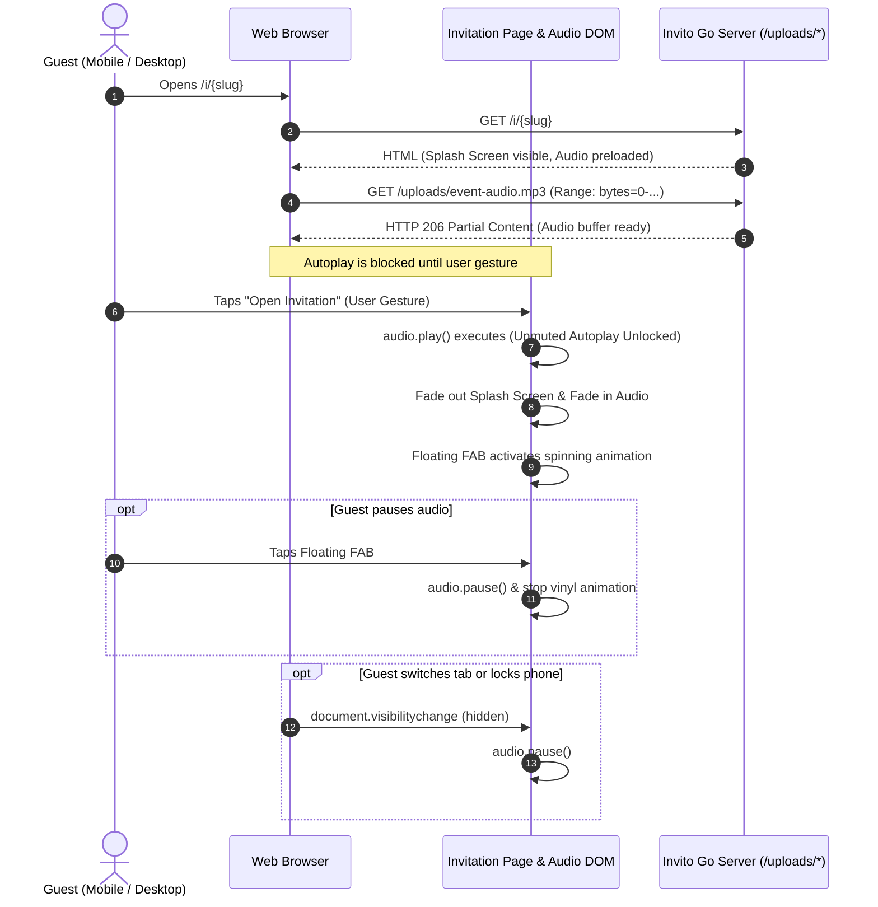

# Background Music & Splash Screen Architecture Overview

## 1. Executive Summary

This initiative enhances **Invito** by introducing background audio playback and an interactive welcome splash screen ("tap-to-open") for digital invitations.

### Core Architectural Decisions

1. **On-Server Static File Serving**:
   - Audio tracks (MP3, M4A, OGG, WAV) are uploaded via the admin portal, stored in `./uploads/` via the existing `MediaStorage` abstraction, and served directly by the Go server via `http.ServeFile`.
   - Native HTTP `206 Partial Content` (byte-range streaming) provides instant playback with zero initial buffering lag, zero external ads, and no third-party branding.
2. **Splash Screen / "Tap-to-Open" Autoplay Resolution**:
   - Modern browsers (iOS Safari, Android Chrome, desktop browsers) strictly prohibit unmuted autoplay before an explicit user gesture.
   - Every invitation supports a customizable Splash Screen (e.g. envelope flap or elegant cover greeting with an "Open Invitation" CTA).
   - Tapping the CTA button fulfills the browser's user gesture requirement, unlocking unmuted playback instantly as the invitation sheet smoothly transitions into view.
3. **Floating Play/Pause Controller (FAB)**:
   - A non-intrusive, theme-styled floating button remains accessible throughout the invitation.
   - Visual feedback: spinning vinyl record or animated equalizer sound waves when playing; paused icon when paused.
   - Integrates tab visibility listeners to pause when guests switch tabs or lock their screens.
4. **Bulma-Native Admin Builder**:
   - Dedicated audio upload and splash configuration controls integrated into the Admin Builder Studio using pure Bulma CSS components and Alpine.js.

---

## 2. Browser Autoplay & Audio Streaming Architecture

---

## 3. Implementation Iterations Breakdown

The implementation is broken down into five distinct, incremental iterations:

| Iteration | Milestone | Core Objective | Primary Components |
| :--- | :--- | :--- | :--- |
| **Iteration 1** | **Audio Storage Pipeline** | Extend `MediaStorage` and `LocalMediaStorage` to validate and store audio assets alongside images without breaking existing contracts. | `pkg/storage/media.go` `pkg/storage/local_media.go` `pkg/server/server.go` |
| **Iteration 2** | **Schema & Domain Modeling** | Update JSON schema and Go domain models to support `music` and `splash_screen` configurations. | `schema/invitation.schema.json` `pkg/domain/invitation.go` `seed/*.json` |
| **Iteration 3** | **Guest Experience: Splash & Player** | Implement the full-screen splash overlay, audio engine, gesture unlock, and floating FAB control. | `web/templates/invitation.html` `web/static/css/invitation.css` `web/static/js/invitation.js` |
| **Iteration 4** | **Admin Editor Studio Integration** | Add Bulma-styled controls in the Admin invitation editor with live preview sync and audio file uploading. | `web/templates/admin/editor.html` `web/static/js/admin_editor.js` |
| **Iteration 5** | **SSG Export & End-to-End Verification** | Ensure audio assets bundle cleanly during static site generation and complete automated/manual test suite. | `pkg/ssg/exporter.go` Unit & Integration Tests |

---

## 4. Architectural Compatibility & Guarantees

* **Zero Breaking Changes**: All `music` and `splash_screen` fields are optional (`omitempty`). Existing invitations, JSON seeds, and database rows will continue rendering identically.
* **Storage Interface Preservation**: The `storage.MediaStorage` interface remains unchanged: `Save`, `Exists`, `Delete`, and `PublicURL`. Only the underlying MIME sniffer and request handler are extended to permit audio formats.
* **Admin Styling Integrity**: Admin UI additions use standard Bulma 1.0 components (`.box`, `.field`, `.file.has-name`, `.control`, `.button`) without introducing ad-hoc CSS rules.
