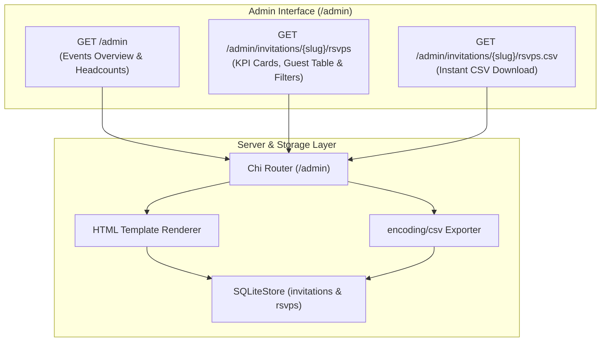

# Implementation Plan: Iteration 2 — RSVP Admin Dashboard & CSV Export

**Status**: 🎯 Ready for Execution

---

## 1. Goal Description
Provide party planners and event hosts with an administrative interface to monitor active events, review guest RSVP responses with attendee headcounts and dietary restrictions, filter guests in real time, and download an RFC 4180 CSV spreadsheet for catering and venue planning.

---

## 2. Deliverables & User Flow



### Key Capabilities
1. **Events Overview (`GET /admin`)**:
   - Lists all events from SQLite with event title, formatted date, location, theme, and response counts.
   - Quick action links to open public digital invitations and navigate to RSVP management.
   - "+ Create Invitation" button (links to `/admin/invitations/new` for Iteration 4).

2. **RSVP Tracker (`GET /admin/invitations/{slug}/rsvps`)**:
   - **4 KPI Metric Cards**:
     - **Total Responses**: `stats.TotalResponses`
     - **Attending Guests**: `stats.AttendingCount` (and total headcount `stats.TotalGuests` including +1s)
     - **Declined**: `stats.DeclinedCount`
     - **Dietary Alerts**: `stats.DietaryCount` (highlighted count for caterers)
   - **Real-Time Client-Side Filtering**:
     - Instant search bar (filter table rows by guest name or email without page reload).
     - Filter pills: `All`, `Attending`, `Declined`, `Dietary Needs`.
   - **Detailed Attendee Table**:
     - Columns: Guest Name, Email, Status Badge (Attending / Declined), Party Size, Dietary Requirements (amber alert pill), Song Request, Message, Submission Timestamp.

3. **Spreadsheet Export (`GET /admin/invitations/{slug}/rsvps.csv`)**:
   - Streams CSV download with RFC 4180 headers:
     `Name, Email, Attending, Guests, Dietary Needs, Song Request, Personal Message, Submitted At`.
   - Filename: `{slug}-rsvps.csv`.

---

## 3. Proposed Changes

### Component 1: Template Engine (`pkg/renderer`)

#### [MODIFY] `pkg/renderer/renderer.go`
- Update `tmpl.ParseFS` to include admin templates:
  ```go
  parsed, err := tmpl.ParseFS(web.Files,
      "templates/*.html",
      "templates/partials/*.html",
      "templates/admin/*.html",
  )
  ```
- Add template helper methods:
  - `RenderAdminIndex(w io.Writer, data any) error`
  - `RenderAdminRSVPs(w io.Writer, data any) error`

---

### Component 2: HTML Views (`web/templates/admin/`)

#### [NEW] `web/templates/admin/base.html`
- Shared administrative layout:
  - Sticky admin navigation header with logo (`✦ Invito Planner`), link to `/admin`, link to `/` (Public Site), and link to `/health`.
  - Links to `/static/css/admin.css` and `/static/js/admin.js`.
  - Clean main container block `{{ block "admin_content" . }}{{ end }}`.

#### [NEW] `web/templates/admin/index.html`
- Extends `admin/base.html`.
- Displays metrics bar (Total Events, Total Confirmed Guests).
- Renders responsive grid or table of event cards:
  - Title, date, venue, theme badge.
  - Confirmed attendee counter badge.
  - Action buttons: "Open Invitation &nearr;" and "Manage RSVPs &rarr;".

#### [NEW] `web/templates/admin/rsvps.html`
- Extends `admin/base.html`.
- Breadcrumb navigation: `&larr; Back to Events`.
- Event header with title, date, venue, and "Download CSV" action button.
- 4 KPI metric cards.
- Search input and filter button group (`All`, `Attending`, `Declined`, `Dietary Requirements`).
- Guest table with attendee rows and styled status pills.

---

### Component 3: Styles & Client Scripts (`web/static`)

#### [NEW] `web/static/css/admin.css`
- Modern, clean dashboard styles using existing design tokens (`base.css`):
  - Metric summary cards with bold numbers and descriptive labels.
  - Data table styling with alternating row shading, padding, and mobile horizontal scrolling.
  - Badge pills: `.badge-success` (green), `.badge-declined` (muted/rose), `.badge-warning` (amber dietary alert).
  - Search input box and filter pills with active state toggling.

#### [NEW] `web/static/js/admin.js`
- Client-side filtering logic:
  - Listens to `#rsvp-search-input` input event and filters table rows matching name/email.
  - Listens to filter pill buttons (`data-filter="all|attending|declined|dietary"`) and toggles row visibility based on row data attributes.

---

### Component 4: Server Routes & Handlers (`pkg/server`)

#### [MODIFY] `pkg/server/server.go`
- Register admin route group in `setupRoutes()`:
  ```go
  s.router.Route("/admin", func(r chi.Router) {
      r.Get("/", s.handleAdminIndex)
      r.Route("/invitations/{slug}", func(r chi.Router) {
          r.Get("/rsvps", s.handleAdminRSVPs)
          r.Get("/rsvps.csv", s.handleAdminExportRSVPsCSV)
      })
  })
  ```
- Implement handlers:
  1. `handleAdminIndex(w, r)`: Queries `s.store.ListInvitations()`, iterates to attach `GetRSVPStats()`, renders `admin/index.html`.
  2. `handleAdminRSVPs(w, r)`: Queries invitation, `s.store.ListRSVPs(slug)`, and `s.store.GetRSVPStats(slug)`, renders `admin/rsvps.html`.
  3. `handleAdminExportRSVPsCSV(w, r)`: Queries RSVPs, sets CSV headers (`text/csv`), uses `encoding/csv.NewWriter(w)` to stream rows.

---

## 4. Verification Plan

### Automated Tests
Add integration tests in `pkg/server/server_test.go`:
1. `GET /admin` returns `200 OK` and contains active event titles.
2. `GET /admin/invitations/sarah-and-alex-wedding/rsvps` returns `200 OK` and renders metric cards and guest table.
3. `GET /admin/invitations/sarah-and-alex-wedding/rsvps.csv` returns `200 OK`, `Content-Type: text/csv`, and valid CSV lines with header.

Execute:
```bash
go test ./pkg/server -v
go test ./... -v
```

### Manual Verification
1. Launch server: `go run main.go --port 8080 --db test_invito.db`.
2. Open `http://localhost:8080/admin` in browser; verify all active events appear with attendee counters.
3. Open `http://localhost:8080/admin/invitations/sarah-and-alex-wedding/rsvps`.
4. Verify KPI cards, submit a test RSVP on another tab, and refresh to verify the count increments.
5. Test live search input and filter buttons (Attending / Declined / Dietary).
6. Click "Export CSV" and inspect the downloaded `.csv` in a text editor or spreadsheet viewer.
