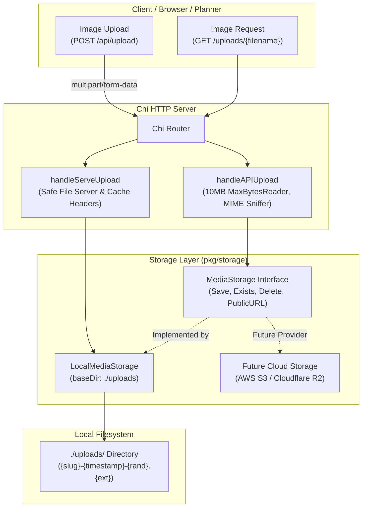

# Milestone Plan & Record: Iteration 3 — Local Image Upload Pipeline

**Status**: ✅ Completed & Verified

---

## 1. Goal & Rationale
Provide a secure, high-performance image upload and asset serving pipeline for **Invito**. This milestone allows event planners to upload custom cover photos, banners, and carousel images (JPEG, PNG, WebP, GIF up to 10MB) via `POST /api/upload`, persists them with collision-resistant filenames (`{slug}-{timestamp}-{rand}.{ext}`) into `./uploads/`, serves them at `GET /uploads/*`, and abstracts the storage layer behind a clean `MediaStorage` interface to allow seamless cloud storage (AWS S3 / Cloudflare R2) in the future.

---

## 2. Architecture & Data Flow



---

## 3. Components Implemented

### `pkg/storage/media.go`
- Declared the core `MediaStorage` interface:
  ```go
  type MediaStorage interface {
      Save(ctx context.Context, input SaveMediaInput) (*MediaInfo, error)
      Exists(ctx context.Context, filename string) (bool, error)
      Delete(ctx context.Context, filename string) error
      PublicURL(filename string) string
  }
  ```
- Declared `SaveMediaInput` and `MediaInfo` structs.
- Defined standardized errors: `ErrFileTooLarge`, `ErrInvalidMediaType`, `ErrEmptyFile`, `ErrFileNotFound`.

### `pkg/storage/local_media.go`
- Local filesystem implementation `LocalMediaStorage`:
  - Enforces 10MB maximum upload size limit.
  - MIME Sniffing: Analyzes first 512 bytes via magic bytes and `http.DetectContentType` to enforce supported image formats (`image/jpeg`, `image/png`, `image/webp`, `image/gif`).
  - Collision-Resistant Filenames: `{slug}-{timestamp}-{rand8}{ext}` where `rand8` is cryptographically random hex from `crypto/rand`.
  - Canonical Extensions: Extensions are derived strictly from sniffed MIME types (`.jpg`, `.png`, `.webp`, `.gif`), preventing extension spoofing.
  - Slug Sanitization: Lowercases, replaces spaces/underscores/slashes with hyphens, removes special characters, and defaults to `"event"` when omitted.
  - Atomic File Writes: Writes to a `.tmp` file before atomically renaming into the destination path (`0644`).

### `pkg/server/server.go`
- Updated `Config` and `Server` to include `UploadsDir string` and `MediaStorage storage.MediaStorage`.
- `POST /api/upload`:
  - Body limited to 10MB + 512KB multipart overhead via `http.MaxBytesReader`.
  - Accepts multipart form field `"image"` and optional `"slug"`.
  - Returns `201 Created` with `MediaInfo` JSON:
    ```json
    {
      "url": "/uploads/test-wedding-1790198376-94b4ceaa.png",
      "filename": "test-wedding-1790198376-94b4ceaa.png",
      "content_type": "image/png",
      "size": 67,
      "created_at": "2026-09-23T18:19:36Z"
    }
    ```
  - Maps errors to appropriate HTTP statuses: `413 Request Entity Too Large`, `415 Unsupported Media Type`, `400 Bad Request`, `500 Internal Server Error`.
- `GET /uploads/*`:
  - Serves assets safely from the configured uploads directory.
  - Path Traversal Guard: Sanitizes path with `filepath.Clean`.
  - Directory Listing Disabled: Returns `404 Not Found` for directory requests.
  - Cache Headers: Sets `Cache-Control: public, max-age=86400` and `X-Content-Type-Options: nosniff`.

### `main.go`
- Added `-uploads` CLI flag (default `"uploads"`).
- Wired `UploadsDir` into `server.Config` and SSG export routine.
- Included uploads directory path in startup banner output.

### `pkg/ssg/ssg.go`
- Added `UploadsDir` to `ssg.Config`.
- Added `copyUploadsStatic` to bundle uploaded media into `<OutputDir>/uploads/` during static site export.

---

## 4. Automated Test Suite

### Storage Unit Tests (`pkg/storage/local_media_test.go`)
- `TestLocalMediaStorage/Save_valid_PNG_image`: Verifies PNG detection, filename formatting, and disk persistence.
- `TestLocalMediaStorage/Save_valid_JPEG_image`: Verifies JPEG detection and `.jpg` extension.
- `TestLocalMediaStorage/Save_valid_WebP_image`: Verifies WebP magic byte detection.
- `TestLocalMediaStorage/Save_valid_GIF_image`: Verifies GIF detection and default `"event"` slug prefix.
- `TestLocalMediaStorage/Collision-resistant_filenames_for_identical_content`: Verifies sequential duplicate saves produce unique filenames.
- `TestLocalMediaStorage/Reject_unsupported_media_type`: Verifies text and PDF files are rejected with `ErrInvalidMediaType`.
- `TestLocalMediaStorage/Reject_empty_file`: Verifies 0-byte uploads are rejected.
- `TestLocalMediaStorage/Enforce_maximum_upload_size_limit`: Verifies byte size threshold triggers `ErrFileTooLarge`.
- `TestLocalMediaStorage/Sanitize_slug_with_path_traversal_attacks`: Verifies `../../etc/passwd` is sanitized safely.
- `TestLocalMediaStorage/Delete_existing_file`: Verifies `Delete` and `Exists` lifecycle.

### Server Integration Tests (`pkg/server/server_test.go`)
- `POST /api/upload uploads valid image and returns 201 with URL`: Full multipart upload integration test.
- `GET /uploads/{filename} serves uploaded asset with correct headers`: Verifies `Content-Type`, `Cache-Control`, and `nosniff`.
- `POST /api/upload rejects non-image file with 415`: Rejects invalid content types.
- `POST /api/upload rejects missing image field with 400`: Rejects payloads missing `"image"`.
- `GET /uploads/ directory request returns 404`: Verifies directory listings are blocked.
- `GET /uploads/nonexistent.png returns 404`: Verifies 404 on missing assets.

### SSG Compatibility Tests (`pkg/ssg/ssg_test.go`)
- `TestSSG_ExportWithUploads`: Verifies uploaded images in `tempUploadsDir` are copied to `<OutputDir>/uploads/`.

---

## 5. Verification Results
```bash
$ go test -count=1 ./...
ok  	invitation/pkg/calendar	0.003s
ok  	invitation/pkg/domain	0.004s
ok  	invitation/pkg/renderer	0.006s
ok  	invitation/pkg/server	0.017s
ok  	invitation/pkg/ssg	0.107s
ok  	invitation/pkg/storage	0.009s
```
