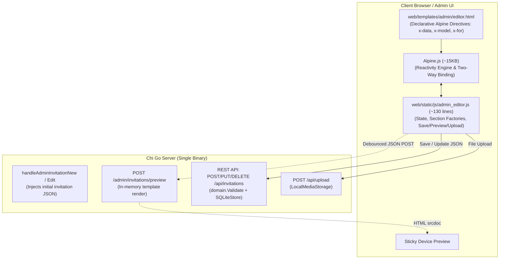

# Implementation Plan & Record: Iteration 4-bis — Alpine.js Invitation Builder Refactor

**Status**: ✅ Completed & Verified

---

## 1. Goal & Rationale

During Iteration 4, the initial builder implementation relied on over 1,300 lines of imperative, manual DOM manipulation (`document.createElement`, nested string templates, manual query selectors, and complex event wiring for 13 polymorphic section schemas). This caused lifecycle race conditions, event listener fragility, and an unmaintainable client footprint.

### The Objective:
Replace the imperative vanilla JS builder with **Alpine.js**:
* **Declarative Reactivity**: Use HTML directives (`x-data`, `x-model`, `<template x-for>`, `<template x-if>`, `@click`) directly in the Go HTML template.
* **Massive Code Reduction**: Slash the client-side JavaScript footprint from 1,370+ lines of brittle DOM code down to a clean, readable **~120–150 line state controller**.
* **Zero-Node Portability**: Maintain Invito's single-binary promise. We start with CDN import for rapid development and vendor the tiny (~15KB) `alpine.min.js` into `web/static/js/vendor/` before completion.
* **Preserve Backend Infrastructure**: Reuse the robust, tested backend endpoints already built in Iteration 4 (`POST /api/invitations`, `PUT /api/invitations/{slug}`, `DELETE /api/invitations/{slug}`, `POST /admin/invitations/preview`, and `POST /api/upload`).

---

## 2. Architecture & Data Flow



---

## 3. Detailed Component Plan

### Component 1: Alpine.js Runtime Loading (`web/templates/admin/editor.html`)
1. **Development Phase**: Load Alpine.js directly via CDN with `defer`:
   ```html
   <script defer src="https://cdn.jsdelivr.net/npm/alpinejs@3.x.x/dist/cdn.min.js"></script>
   ```
2. **Hardening / Vendoring Phase**: Download the single minified file to `web/static/js/vendor/alpine.min.js` so it embeds into `web.Files` with no external network dependency in production. (SKIP FOR NOW)

---

### Component 2: Declarative HTML Template (`web/templates/admin/editor.html`)

Refactor the static form into an Alpine root component:
```html
<div class="builder-layout" x-data="invitationEditor()">
```

#### A. Basic Info & Venue Details
* **Two-way Data Binding**:
  - `x-model="invitation.title"`
  - `x-model="invitation.slug"`
  - `x-model="invitation.subtitle"`
  - `x-model="invitation.date_start"`
  - `x-model="invitation.location.name"`, etc.
* **Auto-Slug Synchronization**:
  - Auto-generate slug from title while `isNew` is true, unless manually modified:
    `@input="if (isNew && !manualSlug) invitation.slug = slugify(invitation.title)"`
  - In edit mode, enforce `:readonly="!isNew"`.

#### B. Theme Selector
* Replaces manual active class toggling with reactive state:
  ```html
  <div class="theme-swatch-card" 
       :class="{ active: invitation.theme.id === 'botanical-elegance' }"
       @click="invitation.theme.id = 'botanical-elegance'">
    ...
  </div>
  ```

#### C. Modular Section Blocks (`<template x-for>`)
Replace manual DOM generation with clean, declarative rendering: (basic suggested implementation, adjust as needed)
```html
<div class="sections-stack">
  <template x-for="(sec, idx) in invitation.sections" :key="sec._uid || idx">
    <div class="section-card">
      <!-- Section Header -->
      <div class="section-card-header">
        <div class="section-card-title-group">
          <span class="section-badge" x-text="sec.type"></span>
          <span class="section-label" x-text="getSectionTitle(sec)"></span>
        </div>
        <div class="section-card-actions">
          <button type="button" class="section-action-btn" @click="moveSection(idx, -1)" :disabled="idx === 0">▲</button>
          <button type="button" class="section-action-btn" @click="moveSection(idx, 1)" :disabled="idx === invitation.sections.length - 1">▼</button>
          <button type="button" class="section-action-btn delete-btn" @click="removeSection(idx)">🗑</button>
        </div>
      </div>

      <!-- Section Body (Conditional by Type) -->
      <div class="section-card-body">
        <!-- Quote Block -->
        <template x-if="sec.type === 'quote'">
          <div class="form-grid">
            <div class="form-group col-12">
              <label class="form-label required">Quote Text</label>
              <textarea class="form-textarea" x-model="sec.text" rows="2"></textarea>
            </div>
            <div class="form-group col-12">
              <label class="form-label">Author</label>
              <input type="text" class="form-input" x-model="sec.author">
            </div>
          </div>
        </template>

        <!-- Timeline Block -->
        <template x-if="sec.type === 'timeline'">
          ...
        </template>
        
        <!-- Hero, Carousel, Dress Code, RSVP, FAQs, Registry, Closing -->
        ...
      </div>
    </div>
  </template>
</div>
```

#### D. Adding Blocks
Adding any block becomes a one-liner:
```html
<button type="button" class="btn btn-secondary" @click="addSection(newSectionType)">
  + Add Block
</button>
```

---

### Component 3: The Alpine State Controller (`web/static/js/admin_editor.js`)

Replace the 1,370-line file with a clean `Alpine.data` registration: (basic suggested implementation, adjust as needed)

```javascript
document.addEventListener('alpine:init', () => {
  Alpine.data('invitationEditor', () => ({
    invitation: {
      version: '1.0',
      slug: '',
      title: '',
      theme: { id: 'botanical-elegance' },
      location: {},
      sections: [],
    },
    isNew: true,
    manualSlug: false,
    newSectionType: 'quote',
    saving: false,
    errors: [],
    successMessage: '',
    syncStatus: 'Live preview synced',
    previewDevice: 'mobile',
    previewTimer: null,

    init() {
      // 1. Bootstrap state from embedded JSON
      const dataEl = document.getElementById('initial-invitation-data');
      if (dataEl && dataEl.textContent.trim()) {
        try {
          const parsed = JSON.parse(dataEl.textContent.trim());
          if (parsed) this.invitation = parsed;
        } catch (e) {
          console.error('Failed to parse initial invitation JSON', e);
        }
      }
      this.isNew = !this.invitation.slug || this.invitation.slug === 'preview';

      // 2. Expose to dev console for direct inspection
      window.editor = this;

      // 3. Reactively sync live preview on any state change
      this.$watch('invitation', () => {
        this.triggerPreview();
      }, { deep: true });

      // 4. Initial preview render
      this.triggerPreview();
    },

    addSection(type) {
      this.invitation.sections.push(createDefaultSection(type));
    },

    removeSection(idx) {
      this.invitation.sections.splice(idx, 1);
    },

    moveSection(idx, direction) {
      const target = idx + direction;
      if (target < 0 || target >= this.invitation.sections.length) return;
      const [item] = this.invitation.sections.splice(idx, 1);
      this.invitation.sections.splice(target, 0, item);
    },

    triggerPreview() {
      clearTimeout(this.previewTimer);
      this.syncStatus = 'Syncing...';
      this.previewTimer = setTimeout(() => this.updatePreview(), 300);
    },

    async updatePreview() {
      try {
        const payload = this.preparePayload();
        const res = await fetch('/admin/invitations/preview', {
          method: 'POST',
          headers: { 'Content-Type': 'application/json' },
          body: JSON.stringify(payload),
        });
        if (res.ok) {
          const html = await res.text();
          const iframe = document.getElementById('preview-iframe');
          if (iframe) iframe.srcdoc = html;
          this.syncStatus = 'Live preview synced';
        }
      } catch {
        this.syncStatus = 'Preview paused';
      }
    },

    async uploadFile(event, targetObj, fieldKey) {
      const file = event.target.files?.[0];
      if (!file) return;

      const fd = new FormData();
      fd.append('image', file);
      if (this.invitation.slug) fd.append('slug', this.invitation.slug);

      try {
        const res = await fetch('/api/upload', { method: 'POST', body: fd });
        const data = await res.json();
        if (res.ok) {
          targetObj[fieldKey] = data.url;
        } else {
          alert('Upload failed: ' + (data.error || res.statusText));
        }
      } catch (err) {
        alert('Upload failed: ' + err.message);
      }
    },

    async save() {
      this.errors = [];
      this.saving = true;

      const url = this.isNew ? '/api/invitations' : `/api/invitations/${encodeURIComponent(this.invitation.slug)}`;
      const method = this.isNew ? 'POST' : 'PUT';

      try {
        const res = await fetch(url, {
          method,
          headers: { 'Content-Type': 'application/json' },
          body: JSON.stringify(this.preparePayload()),
        });
        const data = await res.json();
        if (!res.ok) {
          this.errors = (data.error || 'Failed to save').split(';').map(s => s.trim());
          return;
        }
        this.successMessage = 'Invitation saved successfully!';
        if (this.isNew) {
          this.isNew = false;
          window.history.replaceState(null, '', `/admin/invitations/${data.slug}/edit`);
        }
      } catch (err) {
        this.errors = [err.message];
      } finally {
        this.saving = false;
      }
    },

    // Helper functions for slugify, date formatting, and payload normalization
  }));
});
```

---

## 4. Phased Execution Steps

| Step | Action | Files Touched |
| :--- | :--- | :--- |
| **1** | Add Alpine.js CDN `<script>` to `web/templates/admin/editor.html`. | `web/templates/admin/editor.html` |
| **2** | Rewrite `editor.html` with Alpine directives (`x-data`, `x-model`, `<template x-for>`, `<template x-if>`). | `web/templates/admin/editor.html` |
| **3** | Replace `web/static/js/admin_editor.js` with the clean ~130-line `Alpine.data` controller. | `web/static/js/admin_editor.js` |
| **4** | Manually verify in browser: adding/moving/deleting all 13 blocks, live preview updates, image upload, and save. | Browser (`http://localhost:8080/admin/invitations/new`) |
| **5** | Vendor `alpine.min.js` into `web/static/js/vendor/` and update script tag to point to local asset. | `web/static/js/vendor/alpine.min.js`, `editor.html` |
| **6** | Run automated tests to ensure single-binary compilation and all API tests remain 100% green. | `go test -count=1 ./...` |

---

## 5. Verification Checklist

- [ ] **Console Debugging**: Typing `window.editor` in DevTools exposes the full reactive state.
- [ ] **Add Block Action**: Clicking "+ Add Block" appends the selected section without errors.
- [ ] **Live Preview**: Typing in any field updates the iframe `srcdoc` within 300ms.
- [ ] **Image Upload**: Uploading a photo sets the URL and shows the thumbnail immediately.
- [ ] **Save & Update**: Creating a new event persists to SQLite and locks the slug; editing an existing event updates correctly.
- [ ] **Zero Node Guarantee**: `go build` compiles a standalone single binary with no external runtimes.
