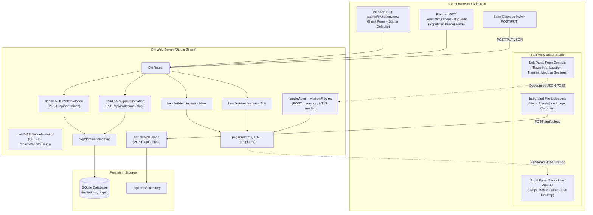

# Implementation Plan & Record: Iteration 4 — Invitation Creation & Editing Form (Builder) + Live Preview

**Status**: ✅ Completed & Verified

---

## 1. Goal Description

Transition **Invito** from a developer-facing static configuration model (`seed/*.json`) into a self-service event invitation studio for party planners and hosts. 

This iteration delivers:
1. **Interactive Event Builder UI** at `GET /admin/invitations/new` and `GET /admin/invitations/{slug}/edit`.
2. **Visual Theme Selector** with swatch preview cards for all 4 pre-built themes (`botanical-elegance`, `golden-sunset`, `midnight-soiree`, `modern-minimal`), plus custom color overrides.
3. **Modular Section Canvas**: Reorderable, toggleable blocks for all 13 supported section types (Hero, Details strip, Quote, Text, Image, Photo Carousel, Timeline schedule, Dress Code, RSVP, External RSVP, FAQs, Gift Registry, and Closing sign-off).
4. **Direct Media Uploads**: Seamless integration with the Iteration 3 `/api/upload` pipeline for instant photo uploads with local preview thumbnails.
5. **Real-Time Split-View Live Preview**: Sticky side-by-side device frame `<iframe>` updating in real-time via `POST /admin/invitations/preview` (using `srcdoc`) before saving, with mobile (375px) and full-width viewport toggles.
6. **Robust Validation & REST Persistence**: Full JSON serialization to `domain.Invitation`, AJAX submission via `POST /api/invitations` and `PUT /api/invitations/{slug}`, and domain validation error reporting.

---

## 2. User Review Required

> [!NOTE]
> **Slug Mutability & Simplicity**:
> - When creating a new invitation at `/admin/invitations/new`, the slug auto-generates from the title (e.g., "Sarah & Alex Wedding" &rarr; `sarah-and-alex-wedding`) with manual editability before saving.
> - **Collision Resolution**: Deferred for now (marked with a simple `TODO!` in code). If a duplicate slug is submitted on `POST /api/invitations`, it simply returns a standard `409 Conflict` error without complex disambiguation UI workflows.
> - **Post-Save Immutability**: Once an invitation is created and committed to SQLite, the slug remains strictly read-only in the edit view (`/admin/invitations/{slug}/edit`). This guarantees that already-printed QR codes, digital pass URLs (`/i/{slug}`), calendar events, and RSVP foreign keys in the database are never inadvertently broken.

> [!NOTE]
> **Zero-Dependency Architecture (Present) & Future JS Roadmap**:
> - For Iteration 4, the builder remains 100% dependency-free using modern HTML5 (`<input type="datetime-local">`, native `<details>`, CSS Grid/Flexbox) and vanilla ES6 embedded via `web.Files`.
> - **Future Candidate Libraries (Post-v1.0)**: If enhanced UX is desired down the road without introducing Node/npm build steps, lightweight vendored standalone scripts can be considered:
>   - **SortableJS** (~10KB): Smooth touch/drag-and-drop card reordering for section blocks and gallery images.
>   - **Flatpickr** (~15KB): Cross-browser datetime picker with consistent timezone display and localized date formatting.
>   - **Cropper.js** (~25KB): In-browser image cropping and aspect ratio framing before dispatching to `/api/upload`.
>   - **Canvas-Confetti** (~3KB): Festive celebration effects on RSVP submissions.

---

## 3. High-Level Architecture & User Flow



---

## 4. Proposed Changes

### Component 1: Server Routes & REST Endpoints (`pkg/server`)

#### [MODIFY] `pkg/server/server.go`

1. **Register New Routes**:
   ```go
   // Admin Editor Views
   s.router.Route("/admin", func(r chi.Router) {
       r.Get("/", s.handleAdminIndex)
       r.Get("/invitations/new", s.handleAdminInvitationNew)
       r.Route("/invitations/{slug}", func(r chi.Router) {
           r.Get("/edit", s.handleAdminInvitationEdit)
           r.Get("/rsvps", s.handleAdminRSVPs)
           r.Get("/rsvps.csv", s.handleAdminExportRSVPsCSV)
       })
       r.Post("/invitations/preview", s.handleAdminInvitationPreview)
   })

   // REST API Endpoints
   s.router.Route("/api", func(r chi.Router) {
       r.Get("/invitations", s.handleAPIListInvitations)
       r.Post("/invitations", s.handleAPICreateInvitation)
       r.Get("/invitations/{slug}", s.handleAPIGetInvitation)
       r.Put("/invitations/{slug}", s.handleAPIUpdateInvitation)
       r.Delete("/invitations/{slug}", s.handleAPIDeleteInvitation)
       r.Get("/invitations/{slug}/rsvps", s.handleAPIListRSVPs)
       r.Post("/upload", s.handleAPIUpload)
   })
   ```

2. **Implement Handlers**:
   - `handleAdminInvitationNew(w, r)`: Creates a starter `domain.Invitation` instance with standard sections (Hero, Details, Quote, Timeline, Dress Code, RSVP, Closing), serializes to JSON, and renders `editor.html` with `IsNew: true`.
   - `handleAdminInvitationEdit(w, r)`: Fetches invitation from `s.store.GetInvitation(slug)`. If not found, renders 404. Serializes to JSON and renders `editor.html` with `IsNew: false`.
   - `handleAdminInvitationPreview(w, r)`: Decodes incoming `domain.Invitation` JSON. Injects sensible preview defaults if fields are empty during active typing (`slug="preview"`, fallback title and venue). Renders HTML directly to `w` using `s.renderer.RenderInvitation(w, &inv)` without touching SQLite.
   - `handleAPICreateInvitation(w, r)`: Decodes `domain.Invitation`, verifies slug does not collide (`409 Conflict`), runs strict `inv.Validate()` (`400 Bad Request` on failure), persists via `s.store.SaveInvitation(&inv)`, and returns `201 Created` with JSON.
   - `handleAPIUpdateInvitation(w, r)`: Verifies existing record, binds payload, runs `inv.Validate()`, persists via `s.store.SaveInvitation(&inv)`, and returns `200 OK` with JSON.
   - `handleAPIDeleteInvitation(w, r)`: Removes invitation and cascades RSVPs via `s.store.DeleteInvitation(slug)`, returns `200 OK`.

---

### Component 2: Template Renderer (`pkg/renderer`)

#### [MODIFY] `pkg/renderer/renderer.go`

Add `RenderAdminEditor` method:
```go
// RenderAdminEditor renders the invitation builder & live preview editor.
func (r *Renderer) RenderAdminEditor(w io.Writer, data any) error {
	return r.adminTmpl.ExecuteTemplate(w, "editor.html", data)
}
```

---

### Component 3: Admin Templates (`web/templates/admin/`)

#### [NEW] `web/templates/admin/editor.html`
- Extends the admin interface with full split-screen studio:
  - **Header Bar**:
    - Breadcrumb navigation (`&larr; Back to Events`).
    - Event Title & Status Badge ("New Invitation" / "Draft" / "Saved").
    - Action Buttons: "Open Public Pass &nearr;" (when saved), "Discard Changes", and "Save Invitation" (with loading spinner).
  - **Builder Form Column (Left)**:
    - Global validation error alert banner.
    - **Section 1: Event Identity**: Title, Slug (auto-generated from title or custom, locked in edit mode), Subtitle, Hosts list, Description, Start & End Datetime (with ISO conversion), Timezone picker.
    - **Section 2: Venue & Location**: Venue Name, Street Address, Google Maps link, Directions/Valet note.
    - **Section 3: Visual Theme**:
      - 4 Visual Theme Cards (`botanical-elegance`, `golden-sunset`, `midnight-soiree`, `modern-minimal`) with color swatches and active indicator.
      - Collapsible Custom Palette Overrides (Primary, Background, Text, Accent, Card Background).
      - Custom CSS editor textarea.
    - **Section 4: Modular Section Blocks**:
      - Drag/reorder handle, Move Up [▲], Move Down [▼], Delete [🗑] controls on every card.
      - Supported Section Blocks:
        - **Hero**: Layout ("full-bleed" vs "banner"), Eyebrow, Vibe, Countdown toggle, Image Uploader button + thumbnail.
        - **Details**: Show Map link toggle, Show Calendar button toggle, Custom labels.
        - **Quote**: Quote text, Author.
        - **Text Announcement**: Title, Text, Text Alignment (left/center/right).
        - **Single Image**: Image Uploader button + thumbnail, Caption, Alt text.
        - **Photo Carousel**: Title, Aspect Ratio (4:3, 16:9, 1:1, 4:5), Fit mode (cover/contain), Multiple Image items with individual upload buttons, captions, and removal.
        - **Timeline**: Title, Milestone items with Time, Title, Description, and Icon selector.
        - **Dress Code**: Title, Attire name (e.g., "Garden Formal"), Description, Palette color chips.
        - **RSVP Form**: Enable toggle, Deadline datetime, Max Party Size, Dietary toggle, Song Request toggle, Custom note.
        - **External RSVP**: Form URL (Google Forms / Tally), Button label, Deadline, Custom note.
        - **FAQs**: Title, Q&A items list.
        - **Gift Registry**: Message, Links list with Store Label and URL.
        - **Closing**: Heartfelt message, Sign-off, Display hosts.
      - "+ Add Section Block" dropdown menu with all available section types.
  - **Live Preview Column (Right)**:
    - Sticky device container.
    - Device switcher: 📱 Mobile Pass (375px width frame) and 💻 Full Width Desktop.
    - Refresh Preview button [🔄] and Open in New Tab [↗].
    - `<iframe>` displaying real-time preview via `srcdoc`.
  - Embedded JSON payload bootstrap: `<script id="initial-invitation-data" type="application/json">{{ .InvitationJSON | safeHTML }}</script>`.

#### [MODIFY] `web/templates/admin/index.html`
- Wire "+ Create Invitation" button directly to `/admin/invitations/new`.
- Add an "Edit &rarr;" button to each event card in the admin grid.
- Add a "Delete" action with confirmation prompt.

---

### Component 4: Styles (`web/static/css/admin.css`)

#### [MODIFY] `web/static/css/admin.css`
Add modern, clean styling for the builder and split-view layout:
- **Split-Screen Studio Layout**:
  - `.builder-layout`: Responsive CSS Grid with form pane and sticky preview pane.
  - `.builder-form-pane`: Padding, form groups, clean card containers.
  - `.builder-preview-pane`: `position: sticky; top: 72px; height: calc(100vh - 90px); display: flex; flex-direction: column;`.
  - `.preview-device-wrapper`: Simulates mobile frame (375px width, rounded corners, subtle shadow) with smooth CSS transition when toggling to desktop.
  - `.preview-iframe`: Seamless border, 100% height.
- **Theme Swatch Cards**:
  - Grid of 4 theme options with color dots representing primary, surface, and text colors.
  - Active state with accent border ring and checkmark indicator.
- **Section Block Cards**:
  - Reorderable accordion cards with clean header, type badge, and action buttons.
  - Form field rows with responsive labels and inputs.
- **Image Uploader Widget**:
  - `.image-uploader`: Row with text input, "Choose File" button, loading spinner, and image thumbnail preview.
- **Device Switcher & Floating Action Bar**:
  - Pill buttons for device toggle (`Mobile 375px` / `Full Pass`).

---

### Component 5: Client-Side Scripts (`web/static/js/admin_editor.js`)

#### [NEW] `web/static/js/admin_editor.js`
- Modular, dependency-free JavaScript:
  - **State Initialization**: Reads `#initial-invitation-data`, falls back to sensible starter data.
  - **Section Builder Engine**:
    - Dynamically renders section cards and inputs.
    - Supports adding any of the 13 section types from templates.
    - Reordering sections (moving up/down in array).
    - Deleting sections.
  - **Image Upload Pipeline**:
    - Intercepts file inputs across Hero, Image, and Carousel sections.
    - Dispatches AJAX `POST /api/upload` with `FormData`.
    - Automatically injects returned `/uploads/{filename}` URL into the input and updates the thumbnail.
    - Triggers debounced preview update.
  - **Live Preview Synchronization**:
    - Listens to input and change events across the form.
    - Debounces updates by 350ms.
    - Serializes current form state into `domain.Invitation` JSON.
    - Dispatches `POST /admin/invitations/preview`.
    - Updates `iframe.srcdoc = html`.
  - **Form Submission & Validation**:
    - Validates required fields before submit (title, slug, date_start, location).
    - Submits via `POST /api/invitations` (new) or `PUT /api/invitations/{slug}` (edit).
    - Displays validation error banner if server returns 400 with domain validation errors.
    - Shows success toast on save, updates URL to edit mode if created, and provides direct link to live pass.

---

### Component 6: Documentation (`docs/plans/iteration-4-invitation-editor.md`)

#### [NEW] `docs/plans/iteration-4-invitation-editor.md`
- Document the completed architecture, API endpoints, template modifications, and test suite results.

---

## 5. Verification Plan

### Automated Tests
Run integration tests:
```bash
$ go test -count=1 ./...
ok  	invitation/pkg/calendar	0.003s
ok  	invitation/pkg/domain	0.005s
ok  	invitation/pkg/renderer	0.010s
ok  	invitation/pkg/server	0.018s
ok  	invitation/pkg/ssg	0.109s
ok  	invitation/pkg/storage	0.010s
```

All 24 test cases in `pkg/server/server_test.go` passed, including:
1. `GET /admin/invitations/new` returns `200 OK` with starter defaults and `admin_editor.js`.
2. `GET /admin/invitations/sarah-and-alex-wedding/edit` returns `200 OK` with pre-populated event details.
3. `GET /admin/invitations/nonexistent-event-slug/edit` returns `404 Not Found`.
4. `POST /admin/invitations/preview` returns `200 OK` with in-memory rendered HTML (`text/html; charset=utf-8`).
5. `POST /api/invitations` creates new record in SQLite and returns `201 Created`.
6. `POST /api/invitations` rejects duplicate slug with `409 Conflict`.
7. `POST /api/invitations` rejects invalid payload with `400 Bad Request`.
8. `PUT /api/invitations/{slug}` updates event in SQLite and returns `200 OK`.
9. `PUT /api/invitations/{slug}` returns `404 Not Found` for nonexistent slug.
10. `DELETE /api/invitations/{slug}` removes event and returns `200 OK`.

### Manual Verification
1. **Launch Server**:
   ```bash
   go run main.go --port 8080 --db test_invito.db
   ```
2. **Create New Invitation**:
   - Navigate to `http://localhost:8080/admin` and click **+ Create Invitation**.
   - Fill in Event Title ("Gabriel's 30th Birthday"), verify slug auto-populates (`gabriels-30th-birthday`).
   - Switch themes by clicking the theme swatch cards (`golden-sunset`, `midnight-soiree`); verify the live preview pane immediately reflects the color palette and typography.
   - Upload an image file for the hero cover; verify upload completes and thumbnail appears.
   - Add a "Photo Carousel" section block, upload 2 photos, set aspect ratio to "16:9".
   - Click **Save Invitation**; verify success toast appears and URL updates to `/admin/invitations/gabriels-30th-birthday/edit`.
3. **Live Preview Interaction**:
   - Toggle device view between 📱 Mobile (375px) and 💻 Desktop.
   - Click "Open Public Pass &nearr;" to verify `/i/gabriels-30th-birthday` loads in a new browser tab.
4. **Edit Existing Invitation**:
   - Navigate to `http://localhost:8080/admin/invitations/sarah-and-alex-wedding/edit`.
   - Update the venue address and reorder sections (move Timeline above Story).
   - Save changes and verify updates persist upon browser reload.
