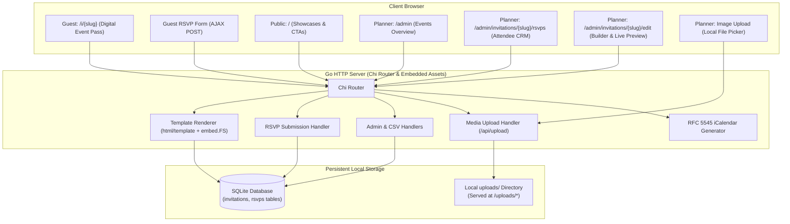
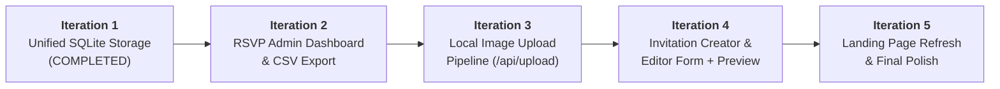

# Full-Stack Transition Overview: Invito

This document outlines the architectural vision, roadmap, and technical guidelines for transitioning **Invito** from a prototype/SSG-focused demo into a production-ready, self-contained, full-stack event invitation web platform.

---

## 1. Vision & Core Objectives

### The Problem
* The initial prototype proved that structured, continuous-canvas digital invitations look stunning and load instantaneously.
* However, editing raw JSON files (`seed/wedding.json`) requires developer knowledge and is unviable for non-technical party planners.
* Pure Static Site Generation (SSG) cannot natively accept two-way interactive RSVP submissions without external third-party form dependencies (Google Forms, Formspree, etc.).

### The Solution
* **Full-Stack Single-Binary Application**: Built with Go, Chi router, embedded HTML templates (`embed.FS`), and a persistent pure-Go SQLite database (`modernc.org/sqlite`).
* **Party Planner Workflow**: Non-technical planners can create events through standard form controls, configure dynamic sections (timelines, photo carousels, dress codes), preview them in real time, and monitor RSVP responses with dietary restrictions and CSV exports.
* **Zero-Ops Reliability**: Runs anywhere as a single compiled binary without Node.js runtimes, npm vulnerabilities, or external database servers.

---

## 2. High-Level Architecture

---

## 3. Data Model & Storage Strategy

We utilize a **hybrid document-relational strategy** in SQLite:
1. **`invitations` table**:
   - Queryable columns: `slug TEXT PRIMARY KEY`, `title TEXT NOT NULL`, `description TEXT`, `created_at DATETIME NOT NULL`, `updated_at DATETIME NOT NULL`.
   - Document column: `data_json TEXT NOT NULL` storing the full validated `domain.Invitation` struct.
   - *Rationale*: Preserves 100% fidelity with the JSON Schema, domain validation rules, and polymorphic `domain.Section` interfaces without complex multi-table joins for arbitrary sections (quotes, carousels, timelines, faqs).
2. **`rsvps` table**:
   - `id INTEGER PRIMARY KEY AUTOINCREMENT`
   - `invitation_slug TEXT NOT NULL REFERENCES invitations(slug) ON DELETE CASCADE`
   - `name TEXT NOT NULL`, `email TEXT NOT NULL`
   - `attending BOOLEAN NOT NULL`, `guest_count INTEGER NOT NULL DEFAULT 1`
   - `dietary_needs TEXT`, `song_request TEXT`, `personal_message TEXT`
   - `submitted_at DATETIME NOT NULL`
   - Indexed on `invitation_slug`.

---

## 4. Phased Iteration Roadmap

The transition is divided into 5 focused, testable milestones. Each iteration delivers a working, independent feature slice:

### Iteration 1: Unified SQLite Storage Layer & Server Wiring
- **Status**: ✅ **Completed** (See [`docs/plans/iteration-1-storage.md`](file:///home/nano/projects/invitation/docs/plans/iteration-1-storage.md))
- **Key Outcomes**:
  - `Store` interface declared (`pkg/storage/store.go`).
  - Pure-Go SQLite engine (`modernc.org/sqlite`) with auto-migrations and auto-seeding from `seed/*.json`.
  - Deprecated and removed volatile `MemoryStore`.
  - Server and CLI integrated with `-db` flag.
  - Complete automated test suite using `:memory:`.

### Iteration 2: RSVP Admin Dashboard & CSV Export
- **Status**: 🎯 **Ready to Implement** (See [`docs/plans/iteration-2-rsvp-dashboard.md`](file:///home/nano/projects/invitation/docs/plans/iteration-2-rsvp-dashboard.md))
- **Scope**:
  - Events management list at `GET /admin`.
  - RSVP tracking dashboard at `GET /admin/invitations/{slug}/rsvps` with KPI cards (Responses, Attendees, Headcount, Dietary alerts) and guest table.
  - Client-side search and status filtering (Attending / Declined / Dietary Alerts).
  - RFC 4180 CSV download at `GET /admin/invitations/{slug}/rsvps.csv`.

### Iteration 3: Local Image Upload Pipeline
- **Status**: ⏳ **Pending**
- **Scope**:
  - Endpoint `POST /api/upload` accepting multipart image files (JPEG, PNG, WebP, GIF) up to 10MB.
  - Storage in `./uploads/` directory with collision-resistant filenames (`{slug}-{timestamp}-{rand}.webp`).
  - Static file route `GET /uploads/*` serving uploaded assets.
  - ImageStorage abstraction allowing seamless swap to AWS S3 or Cloudflare R2 if deployed to cloud in the future.

### Iteration 4: Invitation Creation & Editing Form (Builder) + Live Preview
- **Status**: ⏳ **Pending**
- **Scope**:
  - Form UI at `GET /admin/invitations/new` and `GET /admin/invitations/{slug}/edit`.
  - Field groups: Basic info, Venue details, Visual theme selector (swatch preview cards), and modular section toggles (hero config, quote, carousel, timeline, dress code, RSVP settings).
  - Direct file upload buttons integrated with `/api/upload`.
  - Live split-view or drawer preview `<iframe>` pointing to `/i/{slug}`.
  - Client-side serialization to `domain.Invitation` JSON and AJAX save with domain validation error display.

### Iteration 5: Landing Page Refresh & Final Polish
- **Status**: ⏳ **Pending**
- **Scope**:
  - Redesign `web/templates/index.html` as a clean platform showcase.
  - Call-to-Action buttons: "+ Create Invitation" and "Planner Dashboard".
  - Dynamic "Active Events" grid reading from SQLite with quick links to public invitations and RSVP managers.
  - Comprehensive end-to-end testing and performance review.

---

## 5. Coding & Development Standards

1. **Keep Single Binary Portability**: Templates, CSS, JS, and seed icons must embed via `web.Files` (`embed.FS`).
2. **Zero NPM / Node Dependency**: Avoid Node build pipelines. JavaScript is modern vanilla ES6 modules or lightweight libraries, kept lean and self-contained.
3. **Strict Domain Validation**: Every invitation mutation must pass `inv.Validate()` in [`pkg/domain`](file:///home/nano/projects/invitation/pkg/domain).
4. **Test with `:memory:`**: Unit tests should never write to actual disk database files; use `storage.NewSQLiteStore(":memory:", "seed")`.
